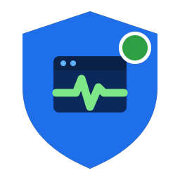

<p align="center">
  
</p>

<h1 align="center">VM Sentinel</h1>
<p align="center"><em>Monitor every VM. Know when something changes.</em></p>

<p align="center">
  
  
  
</p>

> **Beta software.** VM Sentinel is feature-complete for public testing but has
> **not yet been validated on a broad matrix of real Unraid 7.2 hardware**. See
> [Known limitations](#known-limitations) and [`docs/TESTING.md`](docs/TESTING.md).
> Try it on a test system first.

VM Sentinel is a native Unraid plugin that watches your virtual machines and
tells you when something changes — a VM starts, stops, shuts down, crashes,
pauses, resumes, or reboots. It records a local event history, sends alerts
through Unraid's built-in notification system, and can optionally post rich
alerts to a **Discord webhook** (no bot required).

It is **fail-open by design**: a problem inside VM Sentinel can never stop a VM
from starting, stopping, or changing state.

---

## What it does

- **Lifecycle monitoring** through a *namespaced* libvirt hook that coexists with
  other plugins — it never replaces Unraid's shared QEMU hook.
- **Honest classification** — VM Sentinel labels a stop as *normal*,
  *unexpected*, or *reason could not be determined*. It never pretends every stop
  is a crash.
- **Native Unraid notifications** — alerts flow through whatever agents you
  already configured (email, Discord/Telegram/Pushover agents, browser).
- **Optional Discord webhook** with rich embeds, severity colors + text, and
  optional role/user mentions.
- **Optional agentless health checks** — ICMP ping, TCP port, or QEMU guest
  agent — with thresholds so you're alerted only on *confirmed* failure and
  recovery, not every blip.
- **Event history** — searchable, filterable, exportable (CSV/JSON), bounded by
  retention so it never fills your disk.
- **Quiet hours & maintenance suppression**, per-event cooldowns, and
  deduplication to keep the noise down.
- **Diagnostics** with a one-click **sanitized** support bundle.

## Key features at a glance

| Area | Highlights |
|------|-----------|
| Safety | Fail-open hook, no network on the critical path, no VM XML changes, no inbound ports |
| Privacy | No telemetry; the only outbound traffic is *your* Discord webhook + Unraid's local notifier |
| Notifications | Native Unraid + Discord webhook; per-VM, per-event toggles; test buttons |
| Health | ICMP / TCP / guest-agent; stateful thresholds; startup grace period |
| Storage | Config on flash (tiny, atomic); history in appdata (rotated); runtime in RAM |

## Screenshots

Screenshots live in `docs/screenshots/` (placeholders until captured on real
hardware): Overview, VM configuration, Notifications, Event history, Diagnostics.

## Supported Unraid versions

- **Minimum: Unraid 7.2.0** (x86-64). See [`docs/RESEARCH.md`](docs/RESEARCH.md)
  for why. Older releases are not supported.

## Installation (Community Applications)

Once accepted into Community Applications:
1. Open **Apps** in Unraid.
2. Search **VM Sentinel**.
3. Click **Install**.
4. Open **Settings → VM Sentinel**.

## Manual installation (for testing)

1. In Unraid, go to **Plugins → Install Plugin**.
2. Paste the raw `.plg` URL:
   ```
   https://raw.githubusercontent.com/BGriffin63/unraid-vm-sentinel/main/vm.sentinel.plg
   ```
3. Click **Install**. VM Sentinel verifies your Unraid version and package
   checksum, installs its files, installs the libvirt hook, and starts its
   background service.

## Basic setup

1. **Settings → VM Sentinel → Notifications** → turn **Enable monitoring** on.
2. **VMs** tab → pick which VMs to watch and which events matter.
3. Leave **native Unraid notifications** on (default).
4. *(Optional)* paste a **Discord webhook** and click **Send test**.
5. *(Optional)* configure **health checks** per VM.
6. Click **Send test notification**, confirm you receive it, and you're done.

Sensible defaults: crash and unexpected/indeterminate-stop alerts **on**; start,
pause, resume, reboot alerts **off**; Discord and health checks **off** until you
configure them; debug logging **off**.

## Native notification setup

VM Sentinel uses Unraid's own notification system, so configure your delivery
methods under **Settings → Notifications** (email/agents). Anything you enable
there receives VM Sentinel alerts automatically.

## Discord webhook setup

See [`docs/DISCORD-SETUP.md`](docs/DISCORD-SETUP.md). In short: create a channel
webhook in Discord, copy its URL, paste it into VM Sentinel, and send a test.
**No Discord bot is required.** Treat the webhook URL like a password — VM
Sentinel stores it with restricted permissions and redacts it everywhere.

## Health-check setup

Per VM you can enable one agentless check:
- **Ping (ICMP)** — is the VM reachable at an IP/host?
- **TCP port** — is a service listening (e.g. SSH 22, RDP 3389, Home Assistant 8123)?
- **QEMU guest agent** — is the guest agent responding? *(requires the agent in the guest)*

Set the failure/recovery thresholds and a startup grace period so a booting VM
isn't reported unhealthy while its OS comes up. Details in
[`docs/CONFIGURATION.md`](docs/CONFIGURATION.md).

## Security & privacy summary

- No telemetry, no analytics, no ads, no calls to developer servers.
- No inbound ports; no standalone API; no network listener.
- The Discord webhook is the only user-configured outbound destination.
- Secrets stored `0600`, redacted in logs, diagnostics, and exports.
- Full threat model: [`docs/SECURITY.md`](docs/SECURITY.md).

## Data-storage locations

| Data | Location | Notes |
|------|----------|-------|
| Configuration | `/boot/config/plugins/vm.sentinel/config.json` | Tiny, atomic writes, survives reboot |
| Secrets | `/boot/config/plugins/vm.sentinel/secrets.json` | `0600`, webhook only |
| Event history | `/mnt/user/appdata/vm.sentinel/history/` | Rotated JSON Lines; falls back to `/var/log` |
| Runtime (spool/locks/health) | `/var/run/vm.sentinel/` | tmpfs; never on the flash |

## Uninstall behavior

Removing the plugin stops the service, removes **only** VM Sentinel's own libvirt
hook, and clears runtime state. Your config/history under
`/boot/config/plugins/vm.sentinel/` is **kept** by default; delete that folder to
fully remove everything. Running VMs are never affected. See
[`docs/TROUBLESHOOTING.md`](docs/TROUBLESHOOTING.md).

## Troubleshooting

Start with **Settings → VM Sentinel → Diagnostics** and
[`docs/TROUBLESHOOTING.md`](docs/TROUBLESHOOTING.md).

## Support

- Issues: GitHub Issues on this repository.
- Community thread: `YOUR_SUPPORT_THREAD_URL`.
- Security reports: see [`.github/SECURITY.md`](.github/SECURITY.md).

## Contributing

See [`CONTRIBUTING.md`](CONTRIBUTING.md) and [`docs/DEVELOPMENT.md`](docs/DEVELOPMENT.md).
Run `scripts/lint.sh` and `scripts/test.sh` before opening a PR.

## Known limitations

- **Not yet validated across real Unraid 7.2 hardware.** The libvirt `qemu.d/`
  hook mechanism and Unraid `notify` flags are documented but must be confirmed
  on-device (see [`docs/RESEARCH.md`](docs/RESEARCH.md) §7).
- Intent detection is **honest, not perfect** — libvirt does not always reveal
  why a VM stopped; VM Sentinel says so rather than guessing "crash."
- No automatic VM restart/recovery in v1 (by design).
- QEMU guest-agent health check requires the agent inside the guest.

## License

[MIT](LICENSE). The logo and assets are original and licensed with the project.

## Non-affiliation

VM Sentinel is an independent community project for Unraid OS and is **not
affiliated with or endorsed by Lime Technology, Inc.** "Unraid" is a trademark of
Lime Technology, Inc.
