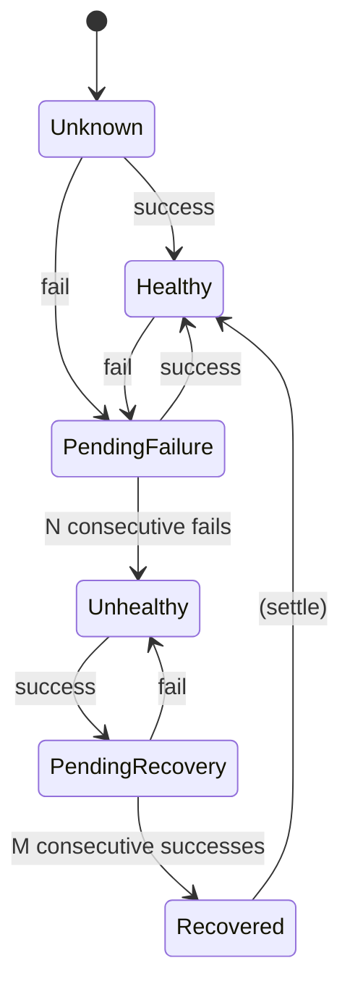

# ReelSentry — Architecture (Phases 2)

ReelSentry is a **fail-open** VM lifecycle monitor for Unraid. A failure
anywhere in ReelSentry must never prevent a VM from changing state. This
document is the authoritative design record; decisions here are justified in
[`RESEARCH.md`](RESEARCH.md).

- **Plugin id:** `reelsentry`
- **Package/WebGUI root:** `/usr/local/emhttp/plugins/reelsentry/`
- **Config root (persistent):** `/boot/config/plugins/reelsentry/`
- **Runtime root (tmpfs):** `/var/run/reelsentry/`
- **History root (appdata, fallback tmpfs):** `/mnt/user/appdata/reelsentry/history/`

---

## 1. Component map

```mermaid
flowchart TD
    subgraph libvirt [libvirt / QEMU critical path]
        H[qemu.d/50-reelsentry hook]
    end
    subgraph tmpfs [/var/run/reelsentry tmpfs]
        SPOOL[(spool/ ndjson events)]
        LOCK[[locks + pid]]
        HSTATE[(health/ state)]
    end
    subgraph svc [Background services]
        PROC[processor.sh]
        HC[healthcheck.sh]
    end
    subgraph store [Persistent + appdata]
        CFG[/boot .../config.json/]
        HIST[(appdata history .jsonl)]
    end
    subgraph out [Notification providers]
        NAT[native.sh -> Unraid notify]
        DIS[discord.sh -> HTTPS webhook]
    end
    subgraph gui [WebGUI PHP]
        OVR[Overview]
        VMC[VM Config]
        NOT[Notifications]
        EVT[Event History]
        DIA[Diagnostics]
    end

    H -->|validate + write, exit 0| SPOOL
    PROC -->|drain, single-flight lock| SPOOL
    PROC --> CFG
    PROC -->|classify + dedup| HIST
    PROC --> NAT
    PROC --> DIS
    HC -->|ICMP/TCP/agent| HSTATE
    HC -->|transition events| SPOOL
    gui --> CFG
    gui --> HIST
    DIA --> tmpfs
```

**The golden rule:** the only thing on the libvirt critical path is `H`, and `H`
never blocks. Everything expensive happens in `PROC`/`HC`, off the critical path.

---

## 2. Event model

Raw libvirt argv → normalized ReelSentry event. See [`EVENT-MODEL.md`](EVENT-MODEL.md)
for the full mapping table. Normalization lives in `src/lib/normalize.sh` and is
the single source of truth (unit-tested outside Unraid).

Normalized event record (one JSON object per history line):

```json
{
  "event_id": "e_<epoch_ns>_<rand>",
  "schema": 1,
  "timestamp": "2026-07-23T20:42:13-05:00",
  "server": "TOWER",
  "vm_uuid": "….",
  "vm_name": "Game PC",
  "raw_action": "stopped",
  "raw_sub_action": "end",
  "event_type": "crashed",
  "previous_state": "running",
  "current_state": "stopped",
  "severity": "critical",
  "classification": "unexpected",
  "health_state": "suspended",
  "notify_attempted": true,
  "notify_results": [{"provider":"native","ok":true},{"provider":"discord","ok":false,"code":404}],
  "summary": "Game PC crashed",
  "details": "Libvirt reported a crash lifecycle event."
}
```

**Durable identity is `vm_uuid`.** Names are display-only and treated as
untrusted (§Security). Per-VM config is keyed by UUID so a rename preserves
settings.

---

## 3. The hook (`src/hooks/reelsentry-hook`)

argv from libvirt: `<vm-name> <operation> <sub-operation> <extra…>`

Algorithm (all paths `exit 0`):
1. `set -u`; never `set -e` in a way that can abort before the guaranteed exit.
2. If runtime dir missing, attempt `mkdir -p` in tmpfs; on failure, `exit 0`
   (fail open — no monitoring, but VM unaffected).
3. Sanitize `vm-name`: strip to a bounded length; the name is **never**
   evaluated — it is written as a single NUL-delimited field, not a shell token.
4. Resolve `vm_uuid` cheaply: read from a small cache map written by the
   processor/GUI (`runtime/uuidmap`), avoiding a `virsh` call on the hot path.
   If unknown, record UUID as empty; the processor backfills it.
5. Compose a single-line spool record (own writer, `printf %q`-free — we use a
   strict field encoder, not shell quoting) and write atomically to
   `spool/<ts>.<rand>.ev` via temp+rename.
6. Best-effort, non-blocking nudge to the processor (see §4). `exit 0`.

The hook does **no** network, DNS, config parse, or notification work. Worst
case runtime is bounded by a single small tmpfs write.

---

## 4. Queue + processor (single-flight)

- **Spool:** `/var/run/reelsentry/spool/*.ev`, tmpfs, append-only files, one
  event each. Bounded: if the spool exceeds `VMS_QUEUE_MAX` files, the hook drops
  the **oldest non-critical** record and increments a dropped counter surfaced in
  Diagnostics (spec §17).
- **Trigger:** the hook nudges the processor. The processor is also run on a
  short timer (see §7) so it drains even if a nudge is lost. This is
  belt-and-suspenders: at-least-once processing.
- **Single-flight:** the processor takes an exclusive `flock` on
  `locks/processor.lock`. A second invocation exits immediately. This prevents
  duplicate processors and races.
- **Draining:** the processor sorts spool files by name (timestamp order), and
  for each: parses, backfills UUID/prev-state via a small state map, classifies,
  **deduplicates** against a short rolling window, applies cooldown / quiet-hours
  / suppression, writes one history line, dispatches enabled providers, then
  `unlink`s the spool file. Corrupt spool files are moved to `spool/bad/` and
  counted, never retried forever.
- **Ordering:** timestamp-named files give per-VM ordering. Rapid reboot bursts
  are collapsed by dedup within `VMS_DEDUP_WINDOW`.

Failure behavior: a provider failure is recorded in `notify_results` and never
aborts draining. Provider-level retry is bounded (small count + backoff) and
network calls have hard connect/total timeouts, so a dead Discord endpoint can
never wedge the queue (spec §11, §19).

---

## 5. Classification (`src/lib/classify.sh`)

Honest three-value model: `expected` / `unexpected` / `indeterminate`
(spec §7). Inputs: normalized event, sub-action, presence of a **maintenance
context marker** (written when Unraid/VM-Manager is shutting down or the array is
stopping, if a supported signal exists — otherwise absent), and recent event
history for the VM.

- graceful `shutdown`/`stopped end` with normal context → `expected`
- libvirt `crashed` / `failed` → `unexpected`
- bare `stopped` with no context → `indeterminate`
- any event during a detected maintenance window → `expected` (labeled
  "monitoring interrupted during Unraid/VM Manager restart")

The UI/notification wording never over-claims. There is no "every stop is a
crash" path. See `EVENT-MODEL.md`.

---

## 6. Health checks (`src/services/healthcheck.sh`)

Agentless, opt-in, disabled by default. Providers: ICMP ping, TCP connect,
optional QEMU guest-agent ping (only if the platform exposes it safely — **[VERIFY]**).
State machine per VM (spec §9.4):



Only `Unhealthy` (failure confirmed) and `Recovered` emit events → the processor
→ notifications. This is the anti-spam guarantee. A **startup grace period**
suppresses failure alerts while a freshly-started guest boots. Checks are
suspended when libvirt reports the VM intentionally stopped. Minimum interval is
clamped to ≥30s. Per-VM `flock` prevents overlapping checks.

Health state lives in tmpfs (`health/<uuid>.state`), so a reboot resets to
`Unknown` (correct — we cannot vouch for pre-reboot state).

---

## 7. Service lifecycle

A tiny supervisor script (`src/services/reelsentry-service`) is started by the
`.plg` and by array-start. It:
- ensures tmpfs dirs exist,
- installs/repairs the hook idempotently,
- runs the **processor** and **healthcheck** loops (each a `while` loop with a
  bounded sleep, guarded by `flock`), and
- exits cleanly on stop, leaving no orphan processes.

No inbound port is opened; no daemon listens on a socket (spec §18). The loops
are plain sleeping loops, the lowest-complexity supported design (spec §6).

---

## 8. Configuration schema

`config.json` (versioned, `"schema": N`) holds global defaults + a `vms` map
keyed by UUID + notification provider settings. **Secrets** (Discord webhook)
live in a **separate** file `secrets.json` with `0600` perms, never echoed to
HTML, never logged, never exported. See [`CONFIGURATION.md`](CONFIGURATION.md).
Migrations are explicit and forward-only (`src/lib/config.sh::migrate`).

Atomic write: serialize → write `config.json.tmp` → `fsync`/`mv` → keep prior as
`config.json.bak`. A parse failure on load falls back to `.bak`, then to
built-in defaults, and records a diagnostics warning (never crashes).

---

## 9. Notification provider interface

`src/notifications/provider.sh` defines the contract. A provider is a shell
function `provider_<name>_send` receiving a normalized event (as env-exported
fields, never as a shell-interpolated command) and printing a structured result
line: `ok=<0|1> code=<int> msg=<redacted>`. Providers shipped: `native`,
`discord`. Future providers (generic/Slack/Teams/Gotify/ntfy/Telegram) are
documented only (spec §12) and not implemented.

---

## 10. Security boundaries

Full model in [`SECURITY.md`](SECURITY.md). Summary:
- VM names, argv, hostnames, ports, URLs, UUIDs are **untrusted**. All are
  validated/escaped at ingress (`src/lib/validate.sh`).
- No `eval`; no shell command built from untrusted strings; every variable
  quoted; JSON built by a dedicated escaper (`src/lib/json.sh`); HTML escaped in
  PHP via `htmlspecialchars`.
- Secrets: `0600`, separate file, redacted in logs/diagnostics/exports/HTML.
- WebGUI writes go through Unraid's CSRF-token convention.
- No listener, no outbound calls except the user-configured Discord webhook and
  the local `notify` CLI.

---

## 11. Install / upgrade / uninstall

See [`../reelsentry.plg`](../reelsentry.plg) and `src/hooks/install-hook.sh`.
- **Install:** verify `MinVer`, unpack `.txz` to the WebGUI root, create dirs,
  install hook idempotently, start service. Never restarts libvirt.
- **Upgrade:** preserve config, run migrations, back up prior config, restart
  only ReelSentry components. Never touches running VMs or libvirt.
- **Uninstall:** stop service, remove **only** `qemu.d/50-reelsentry` (and the
  optional shim if we installed it, restoring `qemu.orig.vmsentinel`), remove
  tmpfs runtime, leave config/history by default (documented), succeed even if
  files are already gone.

---

## 12. Failure matrix (fail-open proofs)

| Condition | Behavior |
|-----------|----------|
| Processor dead | Hook still spools; timer restarts processor; no VM impact. |
| Config corrupt | Load falls back to `.bak` → defaults; warning surfaced. |
| Discord down/DNS fail/TLS fail | Bounded timeout, result recorded failed, queue continues. |
| Native notify fails | Result recorded, queue continues. |
| Spool flooded | Oldest non-critical dropped, counter surfaced. |
| VM renamed | Config keyed by UUID, name updated on next sighting. |
| VM deleted | Marked unavailable; history retained until user clears. |
| Array stopped / libvirt absent | Services idle, GUI shows warning, no crash. |
| Flash read-only | Config save reports a clear error; runtime unaffected. |
| Two GUI saves concurrently | `flock` on config; last valid wins atomically. |
| Clock/DST change | Timestamps are absolute ISO-8601 with offset; logic uses monotonic counters where ordering matters. |
